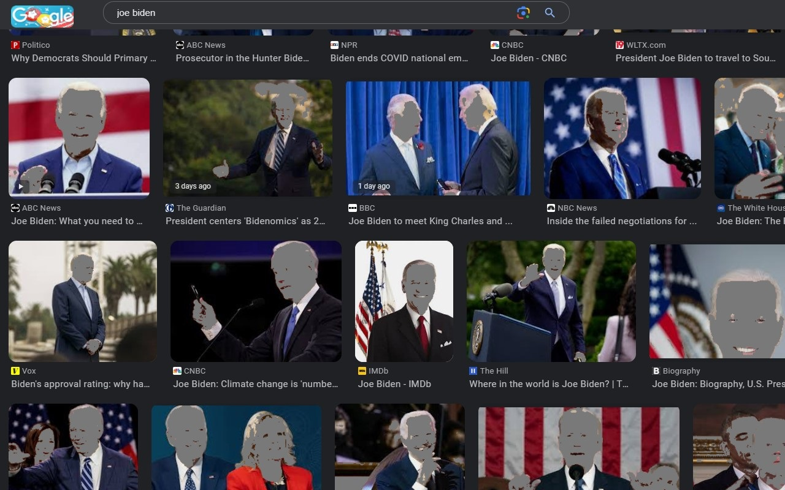

// README.md
# FitnaFilter

A Chrome extension designed to help purify your browsing experience by filtering visual content and blocking access to potentially harmful websites.

## Features

*   **Skin Tone Filtering:** Automatically detects and filters human skin tones in images on websites, replacing them with a neutral greyscale color.
*   **Website Blocking:** Blocks access to websites based on curated blocklists and redirects you to a safe page (`https://quran.com/`).
    *   **Vice Categories (Always On):** Blocks sites related to abuse, drugs, gambling, and pornography. This is non-configurable.
    *   **Hazard & Distraction Categories (Configurable):** Allows enabling/disabling blocking for categories like fraud, malware, phishing, piracy, ransomware, and scams via the Options page.
*   **Configurable Filtering:**
    *   **Exclusion List:** Add specific websites (domains or URLs) to an exception list via the Options page or Popup to disable filtering and blocking on trusted sites.
    *   **Per-Tab Control:** Temporarily disable filtering/blocking (`Exclude for this Tab`) or pause filtering (`Pause for this Tab`) for the current browsing session on a specific tab using the Popup.
    *   **Global Pause:** Temporarily pause the entire extension's filtering functionality globally using the Popup or Alt+P shortcut.
    *   **Auto-Unpause:** Optionally configure the extension to automatically resume filtering after a set time period following a global pause.
    *   **Enhanced Filtering:** Option to attempt removal of basic face features along with skin tones (`Remove face features` in Options).
    *   **Minimum Size Threshold:** Configure the minimum pixel dimensions (`Maximum Safe pixels` in Options) for an image to be subjected to filtering. Smaller images are ignored.
    *   **Hide 'Eye' Icon:** Option to hide the "show original" eye icon that appears when hovering over filtered images (`Don't show the Eye` in Options).
*   **View Original Image:** Allows viewing the original, unfiltered image:
    *   Click the eye icon shown on hover (if enabled).
    *   Use keyboard shortcuts: `Alt+Z` for standard `` elements, `Alt+A` for elements with filtered background images.

## Installation

To install FitnaFilter:

1. Download the extension files from the GitHub repository.
2. Open Chrome and go to `chrome://extensions/`.
3. Enable "Developer mode" in the top right corner.
4. Click "Load unpacked" and select the directory containing the extension files.

## Usage

*   **Filtering:** Image filtering happens automatically on page load for websites not on your exclusion list.
*   **Popup Menu:** Click the FitnaFilter icon in your Chrome toolbar for quick actions:
    *   `Show Images`: Temporarily reveals all filtered images on the current tab.
    *   `Reload Tab`: Refreshes the current tab.
    *   `Exclude Domain`/`Exclude for this Tab`: Add the current site/tab to the exclusion list.
    *   `Pause`/`Pause for this Tab`: Temporarily disable filtering globally or just for the current tab.
    *   Add URLs to the exclusion list.
*   **Options Page:** Access via the Popup link or your Chrome Extensions page (`chrome://extensions`). Here you can:
    *   Manage the website exclusion list.
    *   Toggle Hazard & Distraction blocklist categories.
    *   Configure display settings (Eye icon, Face features, Max safe pixels).
    *   Configure pause settings (Auto-unpause, Timeout).
*   **Keyboard Shortcuts:**
    *   `Alt+P`: Toggle global Pause/Resume.
    *   `Alt+Z`: Show original for a filtered `` element under the mouse cursor.
    *   `Alt+A`: Show original for an element with a filtered background image under the mouse cursor.

<!--  -->

## How it Works

1.  **Content Scripts:** The extension injects scripts into web pages (`js.js`, `ImageProcessing.js`, etc.).
2.  **Element Analysis:** It identifies elements likely to contain images, such as `` tags and elements with CSS `background-image` styles. It uses a `MutationObserver` to detect images added dynamically after the initial page load.
3.  **Pixel Processing:**
    *   For each detected image (above the configured size threshold), it obtains the pixel data using the HTML5 `Canvas API`.
    *   It analyzes each pixel, converting RGB values to YCbCr and HSV color spaces.
    *   Pixels falling within predefined ranges associated with human skin tones are identified.
    *   The identified skin pixels are replaced with a greyscale color (`#7F7F7F`).
4.  **Image Replacement:** The modified image data is converted into a `Blob` URL (`URL.createObjectURL`). This URL is then used to replace the `src` attribute of `` tags or update the `background-image` style of other elements.
5.  **Cross-Origin Handling:** To handle images hosted on different domains (which can cause CORS security errors when accessed directly by content scripts via Canvas), the extension requests the image data via the background service worker (`background.js`), which can perform the fetch without typical CORS restrictions.
6.  **Website Blocking:** The background service worker listens for navigation events (`chrome.webNavigation.onBeforeNavigate`). If the target URL's domain is found in any of the enabled blocklists, the navigation is cancelled, and the tab is redirected to `https://quran.com/`.
7.  **Settings Management:** User preferences (exclusions, pause states, blocklist toggles, display options) are stored using `chrome.storage.sync` (syncs across devices) and `chrome.storage.local` (local to the device).

## Credits

This repository is a fork of https://github.com/yois615/OS-Image-Filter
which is a fork of https://github.com/sosegon/OS-Image-Filter
which is developed based on the chrome extension
[Wizimage](https://chrome.google.com/webstore/detail/wizmage-image-hider/ifoggbfaoakkojipahnplnbfnhhhnmlp?hl=en).

This fork aims to enhance the user interface, improve the filtering algorithms, add robust website blocking, and provide a more comprehensive and configurable safe browsing experience.